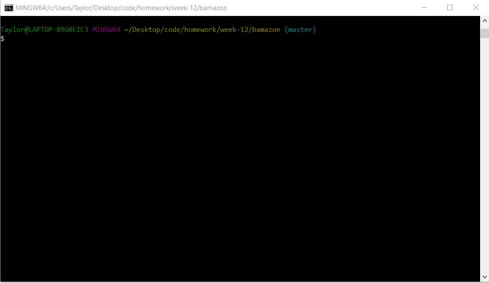

# Bamazon

A play on Amazon.com, __Bamazon__ is an app that allows a user to be either a consumer or a manager. 

In the "Consumer" role, the user can look at a list of items and choose what they would like to buy, and how many.

In the "Manager" role, __the user gets a dropdown menu to choose from.__ 

__They can choose to viewa all the current inventory,__

__To view only products with stock lower than 5 items, 

__To restock any item listed,

__Or to add a new item to the total store inventory. 

## Technologies Used
* MySQL
* Node.js
